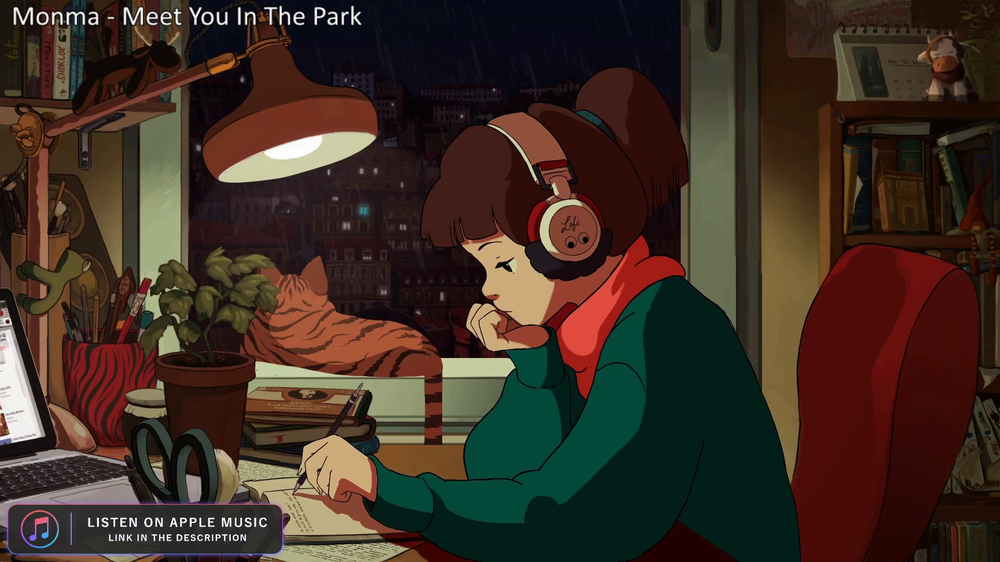
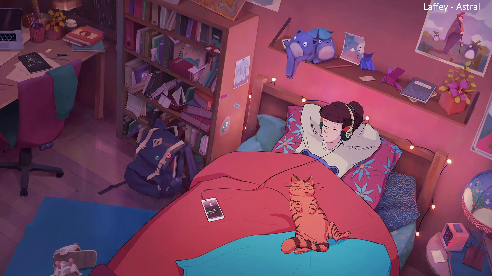

# Lofi Girl Scrobbler 

Lofi Girl Scrobbler helps you scrobble (mark as listened) Lofi Girl (previously known as chilledcow) YouTube live stream music tracks. It is a rewrite of a previous weekend [project](https://github.com/gokberkkocak/chilledcow-scrobbler/) of mine. Now it supports both ```LastFM``` and ```ListenBrainz``` with now playing support on both platforms as well. This time it's written in Rust and it's completely panic free!

# Getting Started

## Pre-Requisites 

This project uses ```opencv``` library to capture\process images and ```tesseract-ocr``` to make an image to text analysis.

### Arch Linux

On a minimal arch installation, these packages (besides rust and cargo) were required to be able compile and run the system;

```
pacman --noconfirm -S openssl pkgconf opencv vtk hdf5 qt5-base glew tesseract tesseract-data-eng clang

```

### Windows

Using [vcpkg](https://github.com/microsoft/vcpkg), it should be possible to compile and use the system.

```
vcpkg install llvm opencv4[contrib,nonfree] tesseract
```

I might be able to get into compiling a static binary for windows later.

## Compiling

One of the crates [rustube](https://lib.rs/crates/rustube) in the project requires nightly compiler so the project only compiles on nightly compiler at the moment.

```rust
cargo +nightly build  --release
```

## Running

```
./target/release/lofigirl
```

## Configuration

To use the system with LastFM, you need a API key and secret. These can be obtained [here](https://www.last.fm/api/account/create). To use with ListenBrainz, you'll need to give your user token which can be found [here].

On the previous project, the system would use the youtube channel information to get live streams however, since it's required YouTube API as well, in this version I decided to simply give the youtube video link directly. Since the livestreams last months, it shouldn't be a big deal. Additionally, it's now also possible to give the second livestream link as well if you want to scrobble that instead. Check ```usage``` for how to do it.

All of the configuration can be put into a toml file like in the [example](https://github.com/gokberkkocak/lofigirl/blob/main/example_config.toml)

```toml
[lastfm] # optional
api_key = "api_key"
api_secret = "api_secret"
username = "username"
password = "password"

[listenbrainz] # optional
token = "token"

[video]
link = "https::///www.youtube.com/something"
second_link = "https::///www.youtube.com/something" # optional
```

Both LastFM and ListenBrainz are optional. You can use one or both depending however you want.

## Usage

```
lofigirl 0.1.0
Now written in Rust

USAGE:
    lofigirl [FLAGS] [OPTIONS]

FLAGS:
    -h, --help       Prints help information
    -s, --second     Use second video link for listen info
    -V, --version    Prints version information

OPTIONS:
    -c, --config <config>    Configuration toml file [default: config.toml]
```
The program will try to use ```config.toml``` as default file. You can give your own file with the config iotuib.

## Docker

Since it's dependent heavy, I decided to provide a docker image as well. 

```
docker pull gokberkkocak/lofigirl
```

To run it pass your configuration file to the container by ```-v```.

```
docker run -d -v /path/to/your/config.toml:/config.toml gokberkkocak/lofigirl:latest 
```

# How does it Work

## Main stream as an example

- rustube takes video link and brings the raw video stream for opencv.
- opencv opens the stream and captures a single frame.

- The image gets cropped

- The background is removed by a mask.

- tesseract-ocr checks the image
- The info is sent to LastFM and/or ListenBrainz.


## Second stream

It work the same way for the second stream as well.
- Full image

- Cropped image

- Masked

- Sending to LastFM and ListenBrainz.


# Limitations

I'm aware that opencv occasionally (sometimes consecutively) fails to read header information from a stream but I haven't managed to find the source of the problem. Because of it, it's possible that some listen information might not be sent. So no guarantees, but I hope it's better than sending nothing!